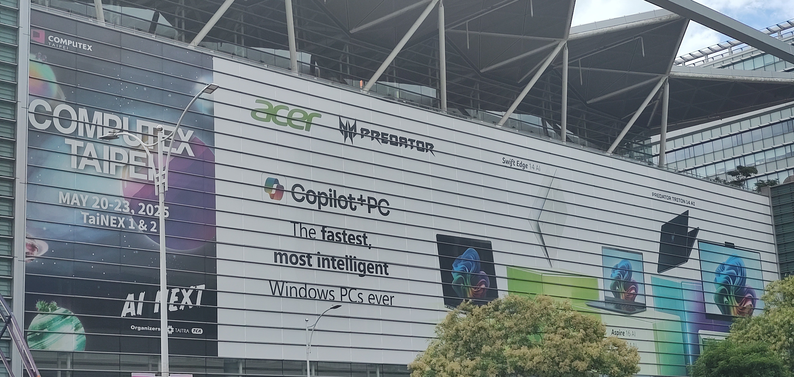
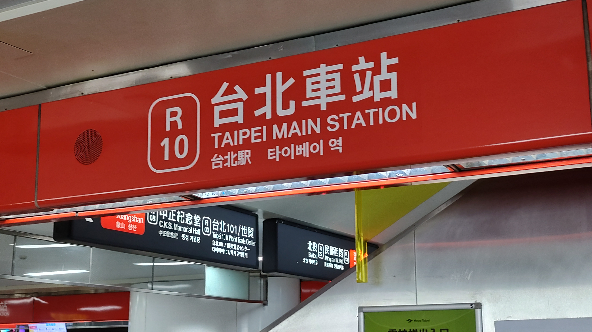

# Hi there, I'm cgy22! 👋

🌐 *Select Language*

---

<b>English</b>

<!---->

I'm a computer science major and developer. I'm all about bridging the gap between logic and creativity—whether I'm coding or arranging a symphony.

#### 💻 My Tech Stack

**Mainly Using:**  

**Also Explored / Learning:**  

#### 🚂 My Tracks & Interests

*   **✈️ Civil Aviation:** I'm a huge aviation geek. I love following flights, airline operations, and global routes.
*   **🚄 Transit & Railways:** From heavy rail to subways, light rail, and monorails—if it runs on tracks, I'm probably tracking it.
*   **🪟 Windows Insider:** A tech enthusiast who loves running bleeding-edge OS builds and testing new features.
*   **🎼 Symphonic Music:** I play a few different instruments and spend my free time composing and arranging full orchestral scores.

---

<b>简体中文 (Simplified Chinese)</b>

<!---->

我是一名计算机科学与技术（计科）专业的在校大学生兼开发者。无论是编写代码，还是谱写一首交响乐，我都享受这种将逻辑与创意完美融合的过程。

#### 💻 我的技术栈

**常用技术：**  

**接触过 / 计划学习：**  

#### 🚂 兴趣与爱好

*   **✈️ 航空：** 妥妥的飞友一枚。对飞行、航司运营以及全球航线网路非常感兴趣。
*   **🚄 轨道交通：** 无论是国铁、地铁、有轨电车还是单轨——只要是跑在轨道上的，我都喜欢。
*   **🪟 Windows 预览体验计划：** 操作系统发烧友，喜欢第一时间体验最新、最前沿的系统特性。
*   **🎼 交响乐与作曲：** 会演奏几种乐器，平时喜欢自己创作和改编交响乐总谱。

---

<b>繁體中文 (Traditional Chinese)</b>

<!---->

我是一名資訊工程（資工）專業的在校大學生兼軟體開發者。無論是撰寫程式碼，還是譜寫一首交響樂，我都享受這種將邏輯與創意完美融合的過程。

#### 💻 我的技術棧

**常用技術：**  

**接觸過 / 計劃學習：**  

#### 🚂 興趣與愛好

*   **✈️ 航空：** 妥妥的飛機迷（飛友）。對飛行、航司營運以及全球航網非常感興趣。
*   **🚄 鐵道：** 無論是台鐵/高鐵、捷運、輕軌還是單軌——只要是跑在軌道上的，我都有研究。
*   **🪟 Windows 測試人員計畫：** 作業系統愛好者，喜歡第一時間體驗最新、最前沿的系統特性。
*   **🎼 交響樂與作曲：** 會演奏幾種樂器，平時喜歡自己創作和編配交響樂總譜。

---

*Feel free to explore my repositories! (But probably nothing useful to see :l )*
